# avr-utils README

Welcome to **`avr-utils`**.

This extension helps users to write and compile code for their avr microcontrollers straight from the comfort of their favourite Code editor, **VScode**

NB: All videos in this **README** are downloadable from the video controls.

## Features

-   ### Projects: Creating and importing

    -   #### >> Create Or Import

        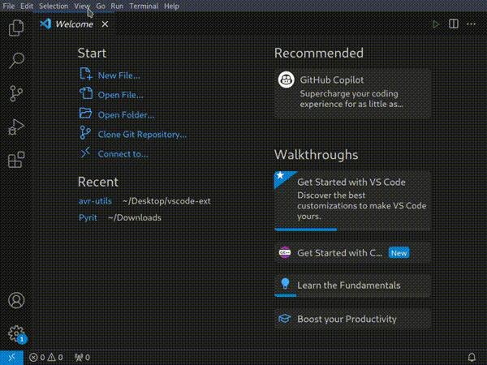

        > **You can create a new avr project or import an existing project created from Microchip/Atmel studio.**

        
After making a choice, VSCode will ask you to choose a folder. 

        -   If opening a Microchip project, it asks for the project folder of your **existing project**.
        -   If creating a new project, it asks for the folder to put the project in, then it asks for a **name** for the project (then asks for permission to load the project if you already have another project open in the editor).  
            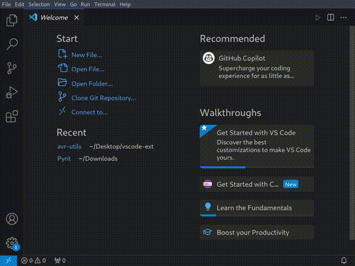

    -   #### >> No Toolchain?

        You may want to build the opened/newly creared project, but you encounter a popup saying you have no toolchain.

        Don't worry, you just have to download a new toolchain (**you don't have to have Microchip Studio**), or if you already have `Microchip Studio` on your device, you can choose to take time to locate the folder within the install directory of `Microchip Studio` which has the name "`avr8-**`" and contains the following folders, or at least 90% of them.

        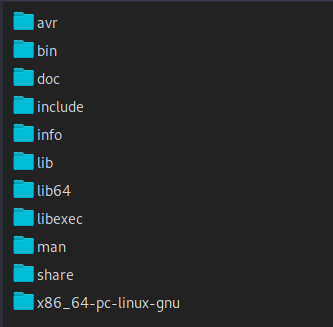 

        > Generally, I recommend downloading a new toolchain to save you the time.

        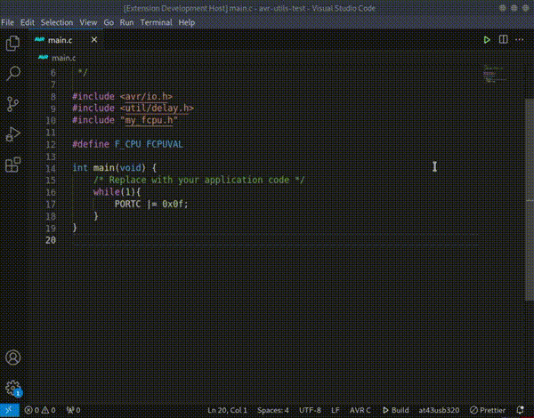

    -   #### >> Select a device first

        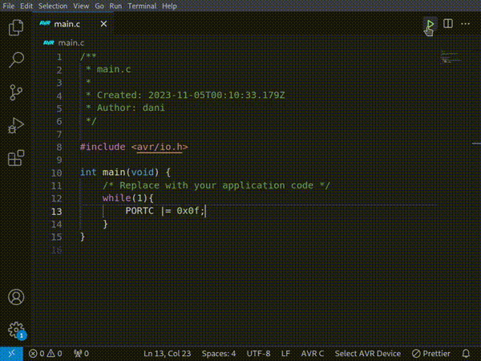

        Before running a successful build in **`c`**, you need to select a microcontroller so that **avr-gcc** does not give build errors.
        

        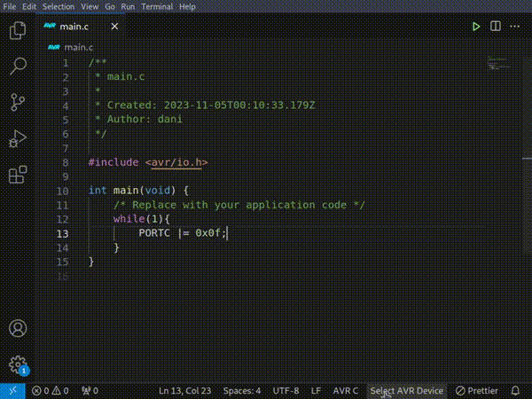

        Once you build the project successfully, you will get a `.elf` file, a `.hex` file and an `.o` file created for you within the Debug folder in your project.

        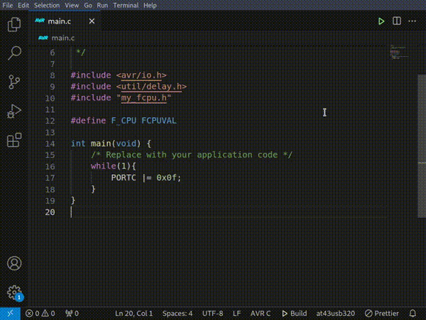

-   ### Code Completions

    -   #### >> Toolchain headers and Project headers

        Within the "`main.c`" file or any other project file in **`c`**, you can get completions for the **avr-gcc** headers or the project-level headers.

        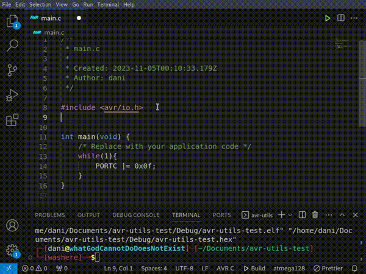

    -   #### >> Header document links

        You can easily open header files if you need to read documentation or edit them through the links provided as shown below.

        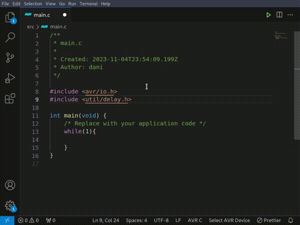

-   ### Object Definitions

    -   #### >> Device header files

        After selecting a device, you can access it's definitions like for registers like `DDRA` or `PORTA`. If the device has a register, you can press `Ctrl` or `Cmd` and click the register variable using your pointer to get taken to the definition, and of course if the register doesn't exist on the selected device, you won't get definitions.

        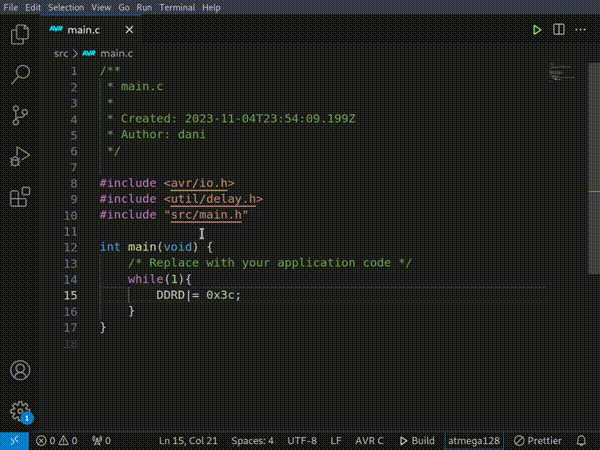

        Of course, this works on variables and functions too.

    -   #### >> Project header files

        Header files within the project directory can also contribute to the definitions. In general, any file that you "`#include`" will contribute to the definitions.

        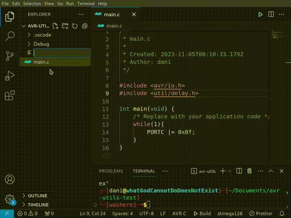

<!-- ## Requirements

If you have any requirements or dependencies, add a section describing those and how to install and configure them. -->

## Command Palette Contributions

The extension comes with some settings added to the command palette. Press `Ctrl+Shift+P` or `Cmd+Shift+P` and type "**AVR Utils**" to view them.

-   `Open Microchip Project`: You can use this to open a project folder for a project created using Microchip Studio (a.k.a Atmel Studio)
-   `Create Project`: This is used to create a new project. This command also creates for you some very minimal boilerplate code in `c` to get you started.

-   `Build/Compile`: This command only appears when the project has been opened and there is an active `c` file.  Take note that this command can also be invoked simply by pressing `F5` on your keyboard, or by the Build button at the bottom of the VSCode window.

## Settings Contributions

The extension also now has some settings accessible from `Ctrl+,` or `Cmd+,` and then search for "**AVR Utils**":

-   `Show terminal at each build`: This setting is useful to ensure that there are no build errors arising from your code since an extension cannot directly get `stdout` from the terminal to parse errors. You can turn this off in case you don't need it.

## Known Issues

If you have the extension `ms-vscode.cpptools` installed, it will cause red squiggles in your code, plus it will create extra buttons in the ui which may not build your AVR. 
Therefore to solve this, I registered a new language called "`AVR C`" which handles the same file extension `.c` and so if you need to use your IDE for normal C development, you can just switch the language as shown below.

## Release Notes

Release notes section.

### 0.0.2

-   Better integration with Assembly language development.
-   Code coloring following tmLanguage rules for both `avr-c` and `asm/s`.

### 0.0.1

Initial release of `avr-utils`
